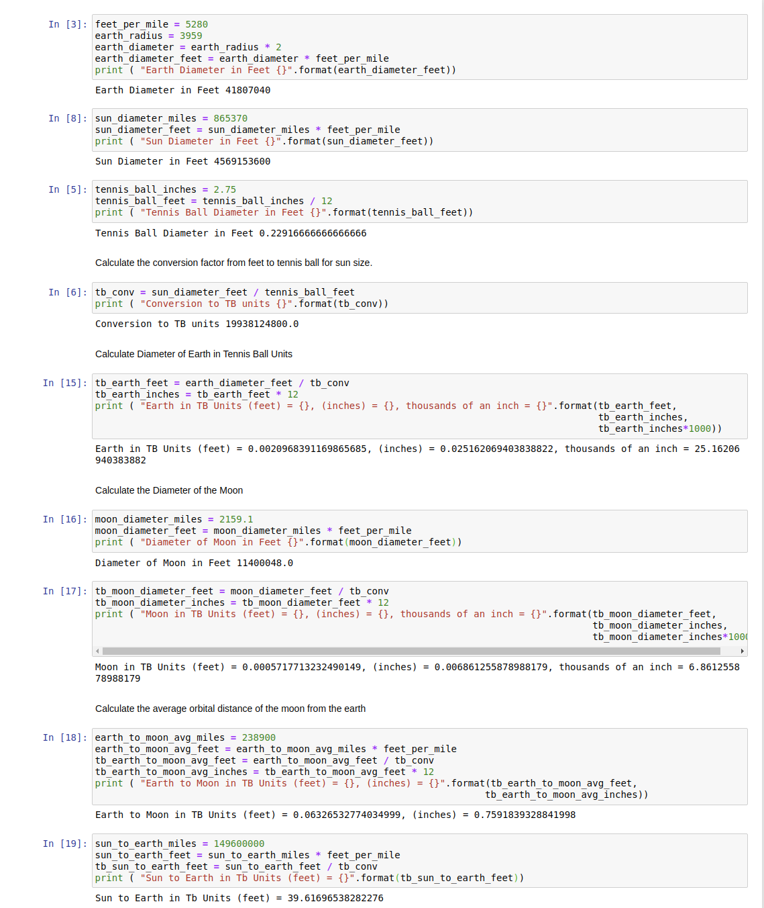

m4_include(../../../setup.m4)

# Lecture 03 - Model of the Solar System

## The Planets


Image from Wikipedia.org (C) NASA -use with permission- CC-BY-SA license.<br>

<div class="pagebreak"></div>

## Calculations for the size of Earth, Sun, Moon.

This is your basic data that you can use to verify that 
your conversion functions for the Homework/Assignment and
the lab are correct.



See the file `Sun-Earth-Moon.ipynb` and to run it 

On Mac or Linux, using iTerm2 on Mac, or Terminal on Linux. If this is the first time you have checked out code from git.:
```
$ cd
$ git clone https://github.com/Univ-Wyo-Education/F21-1010.git
$ cd F21-1010/class/lect/Lect-03
$ jupyter notebook
```

If you already have done the `git clone`:

```
$ cd
$ cd F21-1010
$ git pull
$ cd class/lect/Lect-03
$ jupyter notebook
```

On Windows Using the bash shell that came with git.

```
$ cd /c
$ git clone https://github.com/Univ-Wyo-Education/F21-1010.git
$ cd F21-1010/class/lect/Lect-03
$ jupyter notebook
```

If you already have done the `git clone`:

```
$ cd /c
$ cd F21-1010
$ git pull
$ cd class/lect/Lect-03
$ jupyter notebook
```

Then open the file.

## How computers represent stuff

At a low level computers represent everything as an electrical signal
that is either on or off.

We collect sets of these electrical signals and usually consider off
to be a 0 and on to be a 1.  (Not always sometimes on is a 0 and off
is a 1).

In sets these on/off values of 0/1 are used to make bigger numbers.
All of this is in base 2.  Base 2 has digits 0 and 1.  Base 10 has 
0 to 9.   Most humans are familiar with base 10 and base 60.
The clock on the wall is base 60 - there are 60 minutes to the hour
and 60 seconds to the minute.  Computers use base 2.

So if I have a base 10 number, let's say 13 then it is going to 
take more 0's and 1's to represent it in binary.

| Base 10 | Base 2   |
|---------|----------|
|     0   | 0 0 0 0  |
|     1   | 0 0 0 1  |
|     2   | 0 0 1 0  |
|     3   | 0 0 1 1  |
|     4   | 0 1 0 0  |
|     5   | 0 1 0 1  |
|     6   | 0 1 1 0  |
|     7   | 0 1 1 1  |
|     8   | 1 0 0 0  |
|     9   | 1 0 0 1  |
|    10   | 1 0 1 0  |
|    11   | 1 0 1 1  |
|    12   | 1 1 0 0  |
|    13   | 1 1 0 0  |
|    14   | 1 1 1 0  |
|    15   | 1 1 1 1  |


Computers only have signals that are on/off - that is it.
So characters are represented as numbers.  The letter 'a'
is encoded as a numeric value.  In the most popular encoding
'a' is a 97 in decimal.  'b' is a 98.  So in a certain way
`'a' + 1 == 'b'`

Bigger numbers require more bits to represent.  The computers
that we commonly use have 64 bits for numbers.  Since lots of
people want to represent negative numbers we take 1 bit and 
make it the sign bit, leaving 63 bits for the number.

Floating point numbers are represented as two parts.
First is the exponent.  The second is the number.  Each
has a sign bit.  Roughly 53 bits are for the number and
11 to 12 bits are for the exponent.

This has lots of implications.

The string "12" is not the same as the integer 12
and is not the same as the float 12.0.

## Code Reusability

It would be really long and error prone to have a program
where you put in all the values into the code and every
calculation was inline.  That is what we did in the Jupyter
Notebook.  In the previous class we created a "function"
that allowed us to convert from miles to kilometers.
It took some steps to build this.  We started out with
the inline code and then slowly evolved it into a function
and added tests to verify that it worked.

To create a function you use the Python `def` followed by
a space and a name for the function.  The name should start
with a letter, a..z, then you can have letters or digits
and underscore characters, `_`.   Then you have an open
parenthesis, `(` and a list of name of parameters, then
a close parenthesis, `)` and a colon `:`.

The list of parameters is used in an order dependent 
way.

Let's build a simple function that calculates the length
of the hypotenuse of a right triangle.

```
m4_include(hyp_1.py)
```

Let's try it with some variables:

```
height = 6
width = 8
print ( hypotenuse ( height, width ) )

hh = 10
ww = 22
print ( hypotenuse ( hh, ww ) )

height = 3
width = 4
print ( hypotenuse ( height, width ) )
```


# Copyright

Copyright (C) University of Wyoming, 2021.


