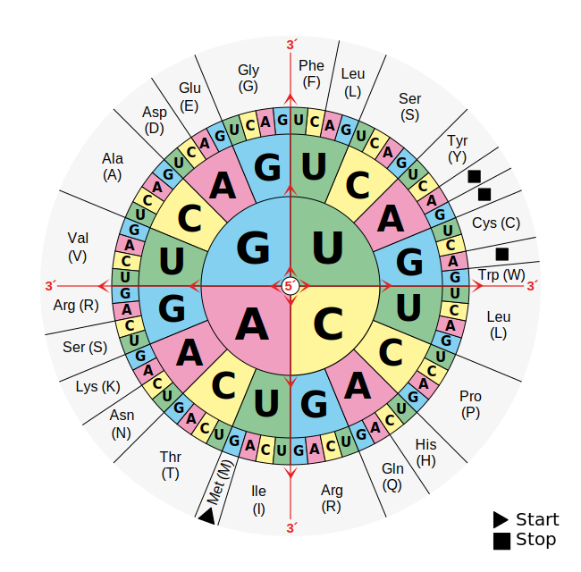

[Amino Acid Chart](By Mouagip - Codons aminoacids table.png, Public Domain, https://commons.wikimedia.org/w/index.php?curid=5986132)

Or if you prefer a table: [https://en.wikipedia.org/wiki/DNA_and_RNA_codon_tables](https://en.wikipedia.org/wiki/DNA_and_RNA_codon_tables)

Le's do a google search and you might find:

[https://github.com/T101J/Translating_RNA_to_Protein]([https://github.com/T101J/Translating_RNA_to_Protein)

this is cool.    A click on the code, and ...
It kind of is what is in the homework ... that has promise.  What is the license?
OOps! no LICENSE file.  Look at the code - they could have put the license in the
file.  Noope!  That means that this is proprietary code - "All Rights Reserved".

Nice chart - but not in the class notes!  This is *Prorietary* code and
the nice blue chart is also!

The code.  Useful to read - but it is not exactly what we want for class.
Remember that we want to scan across to find a start-codon, then take
3 at a time and look them up.  This assumes that you have already found
the start - and just takes 3 at at a time.   It has the processing
for the stop codon.    That is good.   So you can't copy this code
but you can read it and learn from it.

There are about 5 other places where I found the exact same code on
the web.  Nice articles like: 
[https://towardsdatascience.com/starting-off-in-bioinformatics-rna-transcription-and-translation-aaa7a91db031](https://towardsdatascience.com/starting-off-in-bioinformatics-rna-transcription-and-translation-aaa7a91db031)
It has a good explanation of how to do this - but not exactly our requirements.
(It also has the same chart - from what I can tell the chart is actually copyright a biomedical company.)

Note: going from DAN to RNA change 'T' to 'U'

